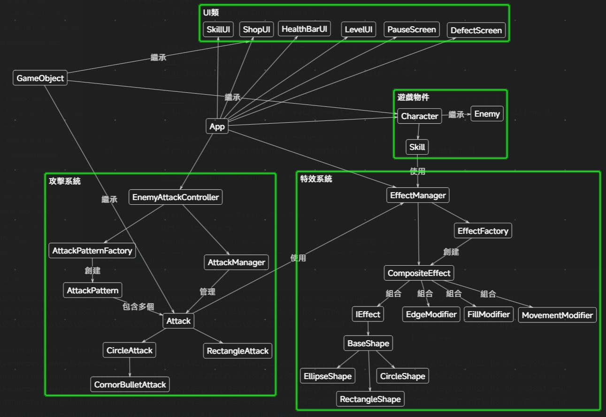

# 2025 OOPL Final Report

## 組別資訊

組別： 31
組員：
- 111820024 廖翊宏
- 111820030 楊承諭

復刻遊戲：Rabbit and Steel

## 專案簡介

### 遊戲簡介
- 彈幕動作遊戲
- 閃躲彈幕 攻擊敵人
- 上下左右控制方向 ZXCV技能
- rogue like元素 擊敗敵人獲得加強
- 影片連結: https://www.youtube.com/watch?v=A3rulL2XkyU&pp=ygUVcmFiYml0IGFuZCBzdGVlbCBzb2xv

### 組別分工
111820024 廖翊宏：
- 遊戲主架構 (App.cpp, main.cpp)
- 角色系統 (Character.cpp)
- 敵人系統 (Enemy.cpp)
- UI系統 (LevelUI, HealthBarUI, ShopUI, DefeatScreen)
- 遊戲階段管理 (PhaseManager)

111820030 楊承諭：
- 完整特效系統 (Effect目錄下所有內容)
- 完整攻擊系統 (Attack目錄下所有內容)
- 攻擊模式工廠 (AttackPatternFactory)
- 部分角色功能
- 技能實作

## 遊戲介紹

### 遊戲規則

1. 角色移動
  - 上移：按下 ↑ (上方向鍵)
  - 下移：按下 ↓ (下方向鍵)
  - 左移：按下 ← (左方向鍵)
  - 右移：按下 → (右方向鍵)
    - 兔子角色會在遊戲畫面設定的邊界內移動，不會超出範圍。

   ---

2. 技能使用
  - 技能 1：按下並鬆開 Z 鍵
    - 如果技能可以使用，兔子會對半徑 200 單位內的敵人造成 $6 \times \text{兔子等級}$ 點傷害。
    - 如果技能 X 處於啟用狀態，則傷害變為 1.5 倍。
  - 技能 2：按下並鬆開 X 鍵
    - 如果技能可以使用，兔子會對掃過路徑上的敵人造成 $2 \times \text{兔子等級}$ 點傷害。
    - 使用後會充能下一次的 Z 或 C 技能，使其傷害變為 1.5 倍。
  - 技能 3：按下並鬆開 C 鍵
    - 如果技能可以使用，兔子立即移動到敵人身旁的位置，並對敵人造成 $10 \times \text{兔子等級}$ 點傷害。
    - 如果技能 X 處於啟用狀態，則傷害變為 1.5 倍。
    - 使用後獲得 0.75 秒的無敵狀態。
  - 技能 4：按下並鬆開 V 鍵
    - 如果技能可以使用，兔子會進入無敵狀態 2 秒，並對敵人造成 $8 \times \text{兔子等級}$ 點傷害。。
   ---

3. 遊戲互動
  - 暫停/確認選擇：在暫停選單和結算畫面中，按下 N 鍵可以選擇選項或確認動作。
  - 暫停選單導航：
    - 上一個選項：按下並鬆開 ↑ (上方向鍵)
    - 下一個選項：按下並鬆開 ↓ (下方向鍵)
  - 商店選單導航：
    - 上一個商品：按下並鬆開 ← (左方向鍵)
    - 下一個商品：按下並鬆開 → (右方向鍵)
    - 購買商品：在商店介面，按下並鬆開 N 鍵。
      - 購買商品 0 (治療)：花費 5 金幣，如果生命條未滿，則補滿生命。
      - 購買商品 1 (經驗)：花費 5 金幣，升 1 級。
  - 離開商店：在商店介面，按下 E 鍵。
  - 與商人互動：當商人可見時，按下 R 鍵可以打開商店介面。
  - 進入下一階段/關卡：當所有敵人被擊敗且「前進」圖示可見時，讓兔子碰撞到「前進」圖示即可進入下一階段。
  - 重玩遊戲：在暫停選單、勝利畫面或戰敗畫面中選擇「新遊戲」選項。

   ---

4. 遊戲狀態
  - 退出遊戲：在遊戲進行過程中，按下 ESC 鍵或觸發遊戲退出條件。
  - 進入無敵模式 (測試用)：按下 G 鍵可以切換無敵狀態(不會扣血量)。
  - 進入作弊模式 (測試用):按下 H 鍵可以作弊模式(所有技能傷害提升至1000)。
   ---

5. 遊戲流程（簡要）
  1. 準備階段：遊戲開始時，玩家需要按下 Z 鍵讓兔子進入起始位置。
  2. 遊戲進行：
    - 擊敗敵人以獲得經驗值。
    - 透過碰撞「前進」圖示進入下一階段。
    - 在商店階段，可以購買物品。
    - 在寶藏階段，攻擊寶箱可以獲得獎勵(金錢)。
  3. 戰敗：當兔子生命值歸零時，遊戲進入戰敗畫面，玩家可以選擇重新開始或退出遊戲。
  4. 勝利：通過所有關卡，遊戲進入勝利畫面，玩家可以選擇重新開始或退出遊戲。

---

## 遊戲畫面


## 程式設計

### 程式架構

### 程式技術

#### 1. 物件池設計模式 (Object Pool Pattern)

我們在特效系統中採用了物件池設計模式，以優化大量特效同時存在時的性能表現：

這種設計具有以下優勢：
- **減少記憶體碎片化**：通過重複使用已分配的物件，減少了動態記憶體分配和釋放操作，避免了記憶體碎片化問題。
- **提高效能**：在彈幕密集的場景中，預先分配特效物件可以顯著提高特效的產生和回收速度。
- **資源管理**：提供了集中管理特效資源的機制，便於追蹤活躍特效的數量和狀態。

**物件池實現流程：**

1. **初始化階段**：系統啟動時，預先為每種特效類型創建多個實例，並存儲在非活躍物件池中。
2. **獲取物件階段**：當需要播放特效時，系統會從對應類型的非活躍池中獲取物件。如果池為空，則創建新的物件。
3. **使用物件階段**：獲取到的物件被設置相應參數（位置、持續時間等）並加入活躍物件列表。
4. **回收物件階段**：當特效播放完成後，系統會重置該物件的狀態，並將其從活躍列表移回非活躍池中。

**物件池運作流程圖：**

```
┌─────────────────────┐     ┌──────────────────┐
│ 初始化               │     │ 非活躍物件池      │
│ EffectManager       │────▶│ m_InactiveEffects│
└─────────────────────┘     └──────────────────┘
                                    │
                                    │ GetEffect()
                                    ▼
┌─────────────────────┐     ┌──────────────────┐
│ 特效需求            │     │ 活躍物件列表       │
│ PlayEffect()        │────▶│ m_ActiveEffects  │
└─────────────────────┘     └──────────────────┘
                                    │
                                    │ Update()
                                    │
       ┌──────────────────────────────────────────┐
       │                                          │
       ▼                                          │
┌─────────────────┐  否  ┌────────────────────┐   │
│ 特效是否完成?    │────▶│ 繼續更新特效         │───┘
└─────────────────┘      └────────────────────┘
       │
       │ 是
       ▼
┌─────────────────────┐
│ 重置特效狀態         │
│ 放回非活躍物件池     │
└─────────────────────┘
```

#### 2. 組合模式 (Composite Pattern)

我們在特效系統中使用了組合模式，使特效可以由多個基本圖形和修飾器組合而成：

這種設計的好處包括：
- **模組化**：將特效的外觀（基本圖形）和行為（修飾器）分離，實現了高度模組化。
- **可擴展性**：新的視覺效果可以通過組合現有的基本圖形和修飾器輕鬆創建，無需修改現有代碼。
- **代碼重用**：基本圖形和修飾器可以在不同的特效中重複使用，提高了代碼的重用性。


## 結語

### 問題與解決方法

1. **特效系統建立**：由於一開始就決定採用渲染方式製作攻擊，而且團隊成員沒有相關經驗，因此在前期建立特效系統時花費了大量時間。我們通過逐步學習和反覆測試，最終建立了一個彈性且效能良好的特效系統。導入物件池設計模式後，不僅解決了記憶體管理問題，還大幅提升了特效的運行效能。

2. **長方形碰撞檢測問題**：在實作長方形碰撞檢測時，我們遇到了效能與精確度的權衡問題。最初嘗試的演算法雖然精確，但在大量物件同時存在時造成明顯的效能下降。經過多次嘗試和優化，我們最終採用了一種簡化的碰撞偵測演算法，在保持合理精確度的同時，將對整體效能的影響降到最低。

3. **渲染層級管理混亂**：由於多個物件都繼承自 GameObject 類別，導致初期 Zindex設置混亂，常常出現物件渲染順序錯誤的問題。我們最終花了一段時間重新梳理所有物件的層級關係，建立了一套統一的 Zindex 管理標準，確保所有遊戲元素都能按照正確的順序渲染，提升了遊戲的視覺效果和專業度。
### 自評

| 項次   | 項目                                    | 完成                |
| ----- | ---------------------------------------- | ------------------ |
| 1     | 基本角色移動與技能系統                      |   ✅              |
| 2     | 敵人與攻擊模式實作                     |   ✅               |
| 3     | 彈幕系統與碰撞判定機制                      |   ✅              |
| 4     | 視覺特效系統（動畫、特效組合）              |   ✅               |
| 5     | UI 介面（血條、技能冷卻、階段提示）          |   ✅              |
| 6     | 音效與背景音樂整合                         |   ⛔               |
| 7     | 商店系統與購買機制                         |   ✅               |
| 8     | 多階段關卡流程與進度管理                    |   ✅              |
| 9     | 勝利/戰敗/暫停畫面邏輯                     |   ✅               |
| 10    | 遊戲狀態管理（開始、進行、結束）             |   ✅              |
| 11    | 上帝模式（除錯用快捷鍵）                    |   ✅              |
| 12    | 技能冷卻與狀態機管理                       |   ✅               |
| 14    | 效能優化（Object Pooling）                 |   ✅              |
| 15    | 繪圖層級管理與顯示順序正確                  |   ✅              |
| 16    | 測試與除錯（技能/特效/邏輯）                |   ✅              |


### 心得

組員 111820024 廖翊宏 的心得：
這次的專案對我來說是一個非常寶貴的學習機會。在實作遊戲主架構、角色與敵人系統以及 UI 介面的過程中，我更深入地理解了物件導向設計的實踐應用，特別是如何透過清晰的模組化來管理複雜的程式碼。處理碰撞系統和遊戲階段管理也讓我學會了如何在遊戲邏輯層面確保各個部分之間的協同運作。雖然過程中也遇到了一些挑戰，例如如何讓各個系統之間順暢地互動，但透過不斷地測試與調整，最終都成功解決了。這次經驗讓我對於遊戲開發的整體流程有了更全面的認識，也提升了我的程式設計能力。


組員 111820030 楊承諭 的心得：
透過這次專案，我們深入學習了遊戲開發的各個面向，從基礎的物件導向設計到進階的效能優化技術。特別是在實作彈幕系統時，體會到了設計模式的重要性，以及如何在效能與功能之間取得平衡。團隊合作方面，我們學會了如何有效分工，並透過良好的程式架構讓雙方的程式碼能夠順利整合。

### 貢獻比例
- 111820024 廖翊宏：50%
- 111820030 楊承諭：50%

### 其他
有對PTSD框架做以下變更 所以有上傳到Github 若重新下載PTSD 需要手動做以下變更
1. 更改 include/Util/Gameobject.hpp 中的 Draw 為 virtual
2. 更改 include/Util/Gameobject.hpp 中的 SetVisible 為 virtual
```
void SetVisible(const bool visible) { m_Visible = visible; }
void Draw();
--->
virtual void SetVisible(const bool visible) { m_Visible = visible; }
virtual void Draw();
```
